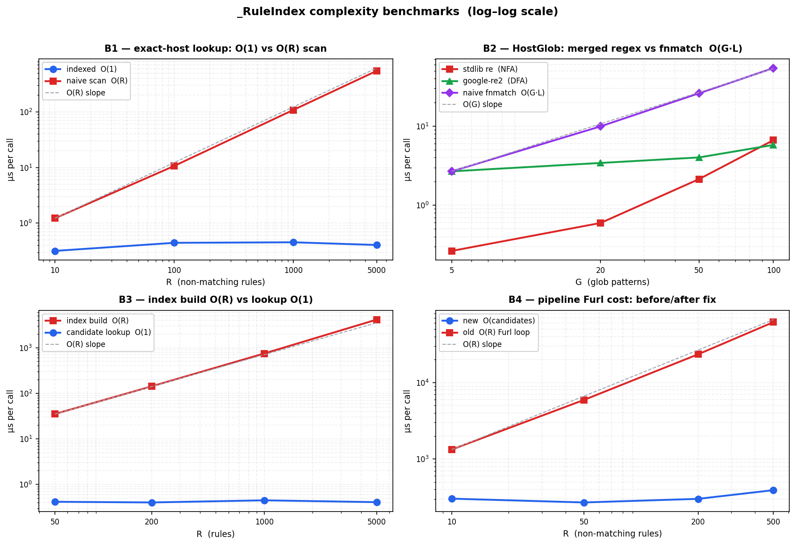
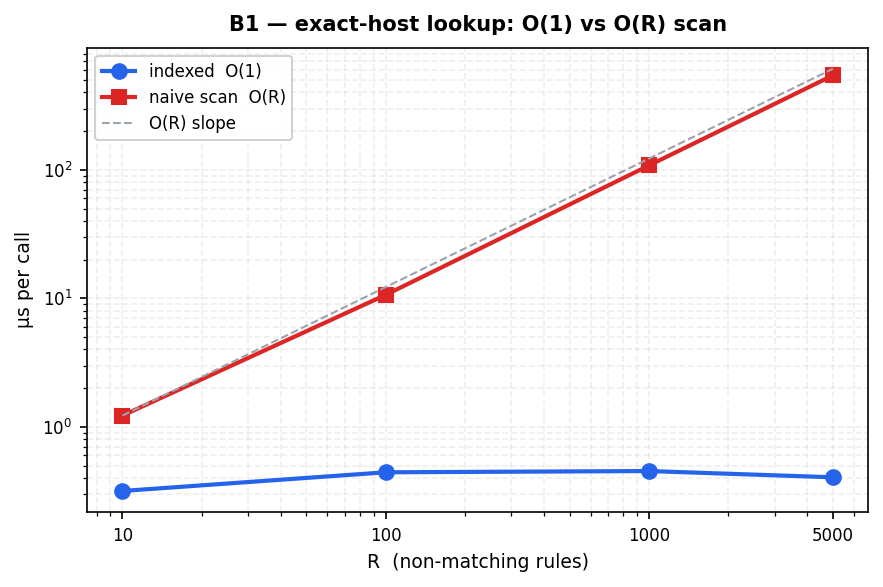
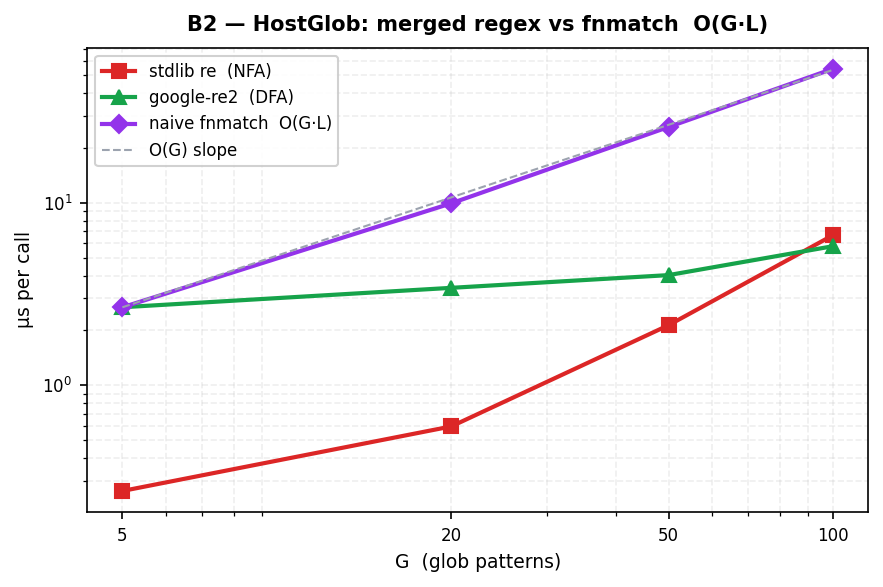
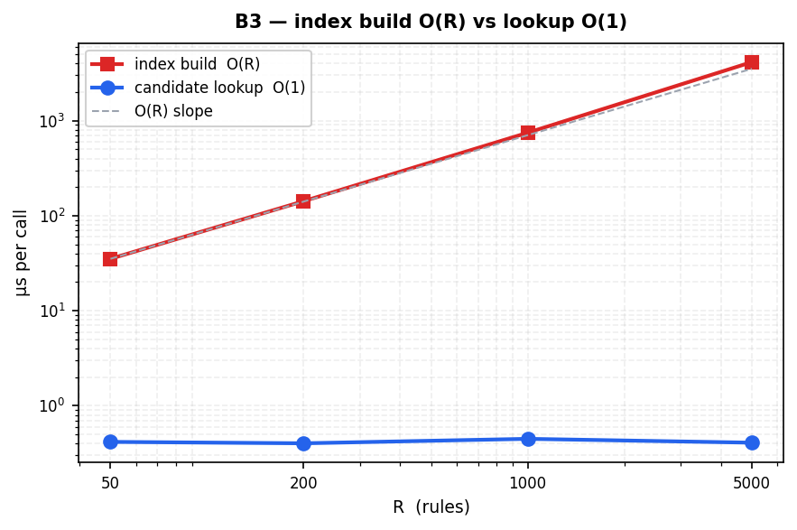
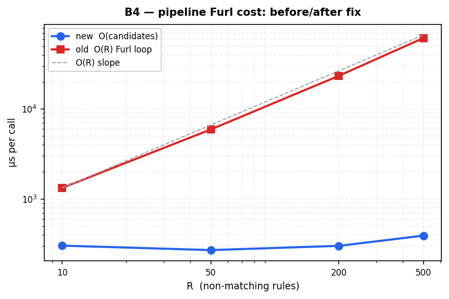

# Benchmark: _RuleIndex Performance

Verifies the complexity claims in [DESIGN.md § Rule Indexing](DESIGN.md#rule-indexing)
and the pipeline Furl fix, using ratio-based assertions that are
**machine-independent**.

---

## Goals

1. Confirm **O(1) exact-host lookup** — `candidate_indices(host)` time is flat
   as the number of non-matching `Host(...)` rules grows.
2. Confirm **O(L) HostGlob matching** — a single merged regex alternation grows
   slower than G individual `fnmatch.fnmatch()` calls. Compare stdlib `re`
   (NFA) against `google-re2` (true DFA).
3. Confirm **index build is O(R), separate from lookup O(1)** — the one-time
   `_RuleIndex(rules)` cost grows with R while `candidate_indices()` stays flat.
4. Confirm **pipeline Furl fix** — moving `Furl(url)` inside the candidate
   guard reduces instantiation cost from O(R) to O(candidates) per
   `canonicalize()` call.

---

## Design

### Ratio-based assertions (machine-independent)

Absolute µs values vary by machine, Python version, and CPU load.
All assertions are expressed as ratios:

| Term | Meaning | Threshold |
|------|---------|-----------|
| **flat** | time doesn't grow as input size increases | `max/min < 5×` across all data points |
| **grows** | time scales with input size | `last/first > 10% of expected growth ratio` |

A threshold of 10% of the expected linear growth is intentionally conservative —
it survives slow machines, timer noise, and Python version differences, while
still catching a genuine regression (e.g., accidentally making a lookup O(R)).

### Benchmark structure

Each benchmark:
1. Iterates over a range of input sizes (R rules or G glob patterns)
2. Measures the **indexed** path and a **naive** baseline at each size
3. Collects all measurements, prints a table, then asserts ratios at the end

### Synthetic rules

Tests use synthetic rules whose hostnames never match the test URL
(`www.youtube.com`), so all non-universal rules are skipped — this isolates
the cost of the skip decision itself.

```
UNIVERSAL_RULE  = Rule(match=AnyHost(), ...)          # always a candidate
exact_rules(R)  = R × Rule(match=Host("hostN.example.com"), ...)   # never match
glob_rules(G)   = G × Rule(match=HostGlob("xN.*.net"), ...)        # never match
```

### Benchmark 1 — exact-host lookup O(1)

Compares `_RuleIndex.candidate_indices(host)` (frozenset + dict lookup) against
calling `rule.match.matches(f)` on every rule (O(R) scan).

R values: 10, 100, 1000, 5000. Rule set: 1 universal + R exact-host rules.

### Benchmark 2 — HostGlob merged regex O(L)

Compares three approaches for matching a hostname against G glob patterns:

- **stdlib `re`** — compiled alternation, NFA backend
- **`google-re2`** — compiled alternation, true DFA backend (optional)
- **naive `fnmatch`** — G separate `fnmatch.fnmatch()` calls, O(G·L)

G values: 5, 20, 50, 100. Hostname: `m.example.com` (no match — worst-case).

### Benchmark 3 — index build O(R) vs lookup O(1)

Compares `_RuleIndex(rules)` (build cost, O(R)) against
`index.candidate_indices(host)` (lookup cost, O(1)).

R values: 50, 200, 1000, 5000.

### Benchmark 4 — pipeline Furl fix

Simulates the `canonicalize()` inner loop before and after the fix of moving
`Furl(url)` inside the candidate guard. `Furl()` costs ~130 µs each, so
O(R) instantiations dominate for large R.

- **new** — `canonicalize()` with fix: 1 upfront parse + 1 per candidate
- **old** — simulated pre-fix loop: 1 `Furl(url)` per rule regardless

R values: 10, 50, 200, 500.

---

## Execution

```bash
cd canonicalizing-urls

# Without google-re2 (re2 column shows N/A):
uv run --group dev python tests/perf_bench.py

# With google-re2 (enables Benchmark 2 re2 column and assertion):
uv run --group dev --group perf python tests/perf_bench.py

# Via pytest (assertions become test failures):
uv run --group dev --group perf pytest tests/perf_bench.py -v -s
```

---

## Results

Results from a representative run (Apple M-series, Python 3.13, `google-re2` installed).



> Figures generated by `uv run scripts/gen_figures.py`. All axes are log–log scale;
> a gray dashed line shows the expected O(R) or O(G) reference slope.

### Benchmark 1 — exact-host lookup



```
    R   index lookup µs   naive .matches() µs   speedup
─────  ────────────────  ────────────────────  ────────
   10             0.317                 1.223      3.9×
  100             0.443                10.640     24.0×
 1000             0.453               108.146    238.8×
 5000             0.405               543.770   1341.2×

Assertions:
  ✓  index lookup flat (max/min): 1.4× < 5×
  ✓  naive grows with R (last/first, expect ~500×): 444.7× > 50×
```

### Benchmark 2 — HostGlob merged regex



```
    G     re µs      re2 µs   fnmatch µs   re2/re   fnmatch/re
─────  ────────  ──────────  ───────────  ───────  ───────────
    5     0.264       2.682        2.680    10.15×        10.1×
   20     0.596       3.426        9.951     5.75×        16.7×
   50     2.138       4.023       26.072     1.88×        12.2×
  100     6.656       5.794       54.361     0.87×         8.2×

Assertions:
  ✓  fnmatch grows with G (last/first, expect ~20×): 20.3× > 5×
  ✓  re2 grows less than fnmatch/3 (DFA vs O(G·L)): 2.2× < 7×
```

### Benchmark 3 — index build vs lookup



```
    R    build µs   lookup µs   build/lookup ratio
─────  ──────────  ──────────  ───────────────────
   50        35.2       0.417                   84×
  200       142.2       0.403                  353×
 1000       747.0       0.449                 1663×
 5000      4135.5       0.409                10112×

Assertions:
  ✓  build grows with R (last/first, expect ~100×): 117.4× > 10×
  ✓  lookup flat (max/min): 1.1× < 5×
```

### Benchmark 4 — pipeline Furl fix



```
    R      new µs      old µs   speedup
─────  ──────────  ──────────  ────────
   10       302.7      1329.9      4.4×
   50       270.1      5929.4     22.0×
  200       301.0     23397.1     77.7×
  500       391.1     61604.2    157.5×

Assertions:
  ✓  new pipeline flat (max/min): 1.4× < 5×
  ✓  old grows with R (last/first, expect ~50×): 46.3× > 5×
```

---

## Insights

**Index lookup is sub-microsecond regardless of R.**
`candidate_indices()` measures ~0.4 µs across R=10 to R=5000 — a frozenset
membership test plus one dict lookup. The O(R) naive scan reaches 544 µs at
R=5000, a 1341× gap.

**`Furl()` at ~130 µs is the dominant per-rule cost in the pipeline.**
This is why the Benchmark 4 fix matters: before the fix, each `canonicalize()`
call instantiated `Furl(url)` once per rule in the loop regardless of the
index. At R=500, that was 500 × 130 µs = 65 ms per call. After the fix,
`Furl()` is called only for candidate rules — ~1 instantiation for a typical
non-matching URL, keeping the cost flat at ~300 µs.

**stdlib `re` and `google-re2` cross over around G ≈ 100.**
`re2` has higher fixed DFA overhead (~2.7 µs at G=5 vs `re`'s 0.26 µs) but
near-flat scaling. Stdlib `re` is faster for small G but grows as the NFA
explores more alternations. For the current RULES list (1 HostGlob pattern),
`re` is the faster backend. `re2` pays off when many `HostGlob` rules are
added.

**Index build is O(R) and is the only part that actually grows.**
For the real RULES list (~12 rules), the build takes ~5 µs — negligible.
At R=5000 it reaches ~4 ms. Because `_index` is passed through recursive
`FollowRedirect` calls, this cost is paid once per top-level `canonicalize()`
call, not once per redirect hop.

**`validate_rules()` is unaffected.**
It runs once at import time, is O(K²) in the number of `KeepParams` rules
(currently K=2), and uses no `Furl`, no regex, and no index — none of the
bottlenecks identified here apply to it.
